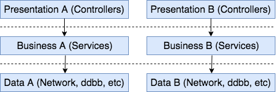
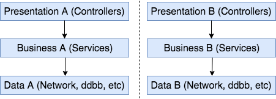
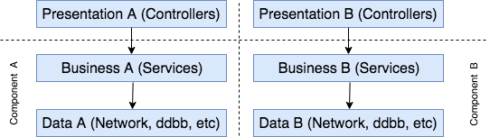
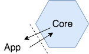

# Clean Architecture

The intention of this repository is to show some of the more common practices when building a mobile app using clean architecture.

WORK IN PROGRESS

## Before start
* iOS
    * Resolve Carthage dependencies. For more [info](https://github.com/Carthage/Carthage)
    ```
    carthage update --platform iOS
    ```
    * To run the project you should create a file called Constants with your own Google Api Key. For more [info](https://developers.google.com/places/web-service/search)
    ```
        class Constants {
            static let googleApiKey = "add-your-own-key"
        }
    ```

## Project structure
* iOS folder -> 
    * Swift iOS project(UI+presentation)
    * Swift iOS core([More info](#architecture))

## Development
* app/places: shows a list of places near your current location

### Pending
* iOS
    * UI testing
    * ViewModel to reduce complexity between view-presenter
    * ViewStateMachine for complex UIs

### Next
* iOS
    * observer

## Tests
* iOS

## Architecture

### Packaging
Packaging is a very important feature in terms of how to structure our code in reusable components.

Kinds of architectures by packanging type:
* Layer

    Widely know by the community, is one of the most used.

    

    | *PROS* | *CONS* | 
    | :---         | :---           |
    | Widely used, so probably most developers know how to use it | |
    | Easy to understand the code that belongs to the same layer | Related code is splitted in layers so flows are not easy to follow |
    | | Each layer should expose their entire API to the upward layer |
    | |  |
* Feature

    

    | *PROS* | *CONS* | 
    | :---         | :---           | 
    | Easy to find related code(grouped in vertical slices) | |
    | Is posibble in some languages to hide code that other pieces shouldn't know | Sometimes is needed to share pieces between vertical slices and encapsulation is broken |
* Component

    

    | *PROS* | *CONS* | 
    | :---         | :---           | 
    | Guide developers to use the architecture as we designed it | |
    | Compile time boundaries to use good practices | |
    | Avoid long sessions checking PR(or skipping) to find undesirable code | |
    | Avoid publishing dependencies from the core that can be used only internally | |

### <u>Package by component</u>
* Problem:

Find a way to built highly reusable pieces of code. Separate application user interface/presentation and use cases in a scalable way.

* Solution:

Build a component that solves the problem, leveraging the presentation details to an outter layer. This way the core can be used along the app, and minimize the coupling between the app layer and our core component.



<b>Swift</b>

In swift we can use a .framework to create our components(Core) and import them in our project(App). This way we can hide internal dependencies of the core and only expose the minimun needed dependencies from the use case perspective. We should use internal access modifiers to avoid publishing non needed dependencies outside of the core, this way we guide developers to a avoid a bad usage of the core. If you need more info on how to create a .framework you can check this [link](https://medium.com/captain-ios-experts/develop-a-swift-framework-1c7fdda27bf1)


* Example usage of PlacesComponent([Core framework](https://github.com/albertopeam/clean-architecture/blob/master/iOS/Project/CleanArchitecture/core/))

    1. import framework: import CleanArchitectureCore
    2. create the component: PlacesComponent.assemble(apiKey: "your-google-api-key")
    3. use the component: places.nearby(output: PlacesOutputProtocol)
    4. handle result/error in PlacesOutputProtocol defined methods

```swift
    import CleanArchitectureCore

    class NearbyPlacesPresenter:PlacesOutputProtocol {

        let places:PlacesProtocol = PlacesComponent.assemble(apiKey: Constants.googleApiKey)

        func nearbyPlaces() {            
            places.nearby(output: self)
        }

        func onNearby(places: Array<Place>) {
            //handle result
        }

        func onNearbyError(error: Error) {
            //handle error
        }
    }
```

* Usefull links:
    * [Full example](https://github.com/albertopeam/clean-architecture/blob/master/iOS/CleanArchitecture/app/places/NearbyPlacesPresenter.swift)

## Patterns

### <u>Promise</u>
* Problem:

One of the most commnon pitfalls which developers who use asynchronous APIS can find is callback hell.
Sometimes the nature of the APIS that we use instigate us to nest async code. At the start maybe we can manage it, but when 
the system becomes bigger and bigger it will become a problem because the code will be too complex to read and test.

<b>Swift</b>

 ```swift
func fetchData(callback:Callback){
    let url = URL(string: urlString)
    URLSession.shared.dataTask(with: url!) { (data, response, error) in
        if error != nil {
            DispatchQueue.main.sync {
                callback.error(nil, error)
            }
        }else{
            let url2 = URL(string: urlString2)
            URLSession.shared.dataTask(with: url2!) { (data, response, error) in
                DispatchQueue.main.sync {
                    if error != nil {
                        callback.error(nil, error)
                    }else{
                        callback.success(data, nil)
                    }
                }
            }.resume()
        }
    }.resume()
}
 ```
* Solution: 

To apply a pattern that allows us to hide the complexity of the asynchronous operations and provide a way to handle them as if they were synchronous. 
A promise represents the eventual result of an asynchronous operation; we can chain as many promises as we want in a synchronous way.

<b>Swift</b>
```swift
let fetchWork1:Work1
let fetchWork2:Work2

func fetchData(callback:Callback) {
    Promise(work: fetchWork1)
    .then { (result) -> Promise in
        return Promise(work: fetchWork2, params:result)
    }.then { (result) in
        callback.success(result: result)
    }.error { (error) in
        callback.error(error: error)
    }
}

class Work1:NSObject, Work {
    func run(params:Any?, resolve: @escaping (Any) -> Void, reject: @escaping Reject) throws {
        let url = URL(string: urlString)
        URLSession.shared.dataTask(with: url!) { (data, response, error) in
            DispatchQueue.main.sync {
                if error != nil {
                    reject(error!)
                }else{
                    resolve(data!)
                }
            }
        }.resume()
    }
}
```

* Usefull links:
    * [Full example](https://github.com/albertopeam/clean-architecture/blob/master/iOS/Core/CleanArchitectureCore/places/Places.swift)
    * [How to test](https://github.com/albertopeam/clean-architecture/blob/master/iOS/Core/CleanArchitectureCoreTests/places/PlacesTest.swift)


| *PROS* | *CONS* | 
| :---         | :---           | 
| Avoid callback hell | Use of casts in completion blocks |
| The code is easier to read and mantain  | |
| Better error handling(unified) | |
| Asynchronous API for sync and async operations  | |

## License
Copyright (c) 2018 Alberto Penas Amor

Permission is hereby granted, free of charge, to any person obtaining a copy
of this software and associated documentation files (the "Software"), to deal
in the Software without restriction, including without limitation the rights
to use, copy, modify, merge, publish, distribute, sublicense, and/or sell
copies of the Software, and to permit persons to whom the Software is
furnished to do so, subject to the following conditions:

The above copyright notice and this permission notice shall be included in all
copies or substantial portions of the Software.

THE SOFTWARE IS PROVIDED "AS IS", WITHOUT WARRANTY OF ANY KIND, EXPRESS OR
IMPLIED, INCLUDING BUT NOT LIMITED TO THE WARRANTIES OF MERCHANTABILITY,
FITNESS FOR A PARTICULAR PURPOSE AND NONINFRINGEMENT. IN NO EVENT SHALL THE
AUTHORS OR COPYRIGHT HOLDERS BE LIABLE FOR ANY CLAIM, DAMAGES OR OTHER
LIABILITY, WHETHER IN AN ACTION OF CONTRACT, TORT OR OTHERWISE, ARISING FROM,
OUT OF OR IN CONNECTION WITH THE SOFTWARE OR THE USE OR OTHER DEALINGS IN THE
SOFTWARE.
