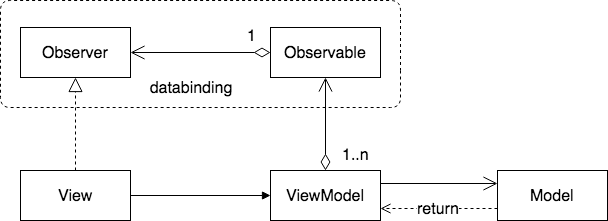

# Clean Architecture

[](https://travis-ci.org/albertopeam/clean-architecture)
[](https://codecov.io/gh/albertopeam/clean-architecture)
[](https://codeclimate.com/github/albertopeam/clean-architecture/maintainability)
[](https://developer.apple.com/swift)
[](https://opensource.org/licenses/MIT)
<!-- TODO: pending [](https://codeclimate.com/github/albertopeam/clean-architecture/test_coverage) -->

 
The intention of this repository is to show some of the more common practices when building a mobile app using clean architecture.

## Table of Contents
1. [Before start](#before-start)
2. [What do you expect to see soon?](#what-do-you-expect-to-see-soon?)
3. [Architecture](#architecture)
4. [Patterns](#patterns)
    1. [Promises](#promises)
        * [Legacy](#swift:-Legacy)
        * [Serial](#swift:-Serial-work)
        * [Parallel](#swift:-Parallel-work)
        * [by Sundell](#swift-Sundell)
    2. [MVVM](#mvvm(model-view-view-model))
        * [View-Model](#Swift:-Observer)
        * [Widget](#Swift:-Reusing-View-Model-in-TodayExtension)
    3. [MVP](#mvp(model-view-presenter))
5. [Testing](#testing)
   1. [Unit testing](#Unit-testing)
   2. [Integration testing](#Integration-testing)
   3. [UI/Functional testing](#UI/Functional-testing)
  
## Before start

* Resolve Carthage dependencies. For more [info](https://github.com/Carthage/Carthage)
```
carthage update --platform iOS
```
 * To run the project you should fill the Constants with your own Google Api Key and OpenWeather Api Key. For more [Google info](https://developers.google.com/places/web-service/search), for more [Open weather info](https://openweathermap.org/appid)
```
    class Constants {
        static let googleApiKey = "add-your-own-key"
        static let openWeatherApiKey = "add-your-own-key"
    }
```

### App
* app/places: shows a list of places near your current location
* app/weather/weather: shows the weather in a list of places.
* app/weather/current: shows the weather in your current location.
* app/uvindex: shows the ultraviolet index in your current location.
* app/airquality: shows the air quality index in your current location.

### Extensions
* UltravioletIndexWidget: shows the ultraviolet index in your current location on a widget.

### Testing
* You can check the coverage on [codecov](https://codecov.io/gh/albertopeam/clean-architecture)

<!---
## Project structure
* iOS folder -> Swift iOS project
--->
## What do you expect to see soon?
### Next
* Inject Constants from Environment instead of hardcode it in the app
* Framework usage to avoid all the code to seen as public
* View State pattern for complex UIs
* Repository pattern
* Robots Pattern(Testing) <!-- https://academy.realm.io/posts/kau-jake-wharton-testing-robots/ -->

## Architecture

### Packaging
Packaging is a very important feature in terms of how to structure our code in reusable components.

Kinds of architectures by packanging type:
* Layer

Widely know by the community, is one of the most used.


| *PROS* | *CONS* | 
| :---         | :---           |
| Widely used, so probably most developers know how to use it | |
| Easy to understand the code that belongs to the same layer | Related code is splitted in layers so flows are not easy to follow |
| | Each layer should expose their entire API to the upward layer |
| |  |
* Feature


| *PROS* | *CONS* | 
| :---         | :---           | 
| Easy to find related code(grouped in vertical slices) | |
| Is posibble in some languages to hide code that other pieces shouldn't know | Sometimes is needed to share pieces between vertical slices and encapsulation is broken |
* Component


| *PROS* | *CONS* | 
| :---         | :---           | 
| Guide developers to use the architecture as we designed it | |
| Compile time boundaries to use good practices | |
| Avoid long sessions checking PR(or skipping) to find undesirable code | |
| Avoid publishing dependencies from the core that can be used only internally | |

### <u>Package by component</u>
* Problem:

Find a way to built highly reusable pieces of code. Separate application user interface/presentation and use cases in a scalable way.

* Solution:

Build a component that solves the problem, leveraging the presentation details to an outter layer. This way the core can be used along the app, and minimize the coupling between the app layer and our core component.


<!--- Commented until a framework is created with some component
<b>Swift</b>

In swift we can use a .framework to create our components(Core) and import them in our project(App). This way we can hide internal dependencies of the core and only expose the minimun needed dependencies from the use case perspective. We should use internal access modifiers to avoid publishing non needed dependencies outside of the core, this way we guide developers to a avoid a bad usage of the core. If you need more info on how to create a .framework you can check this [link](https://medium.com/captain-ios-experts/develop-a-swift-framework-1c7fdda27bf1)


* Example usage of PlacesComponent([Core framework](https://github.com/albertopeam/clean-architecture/blob/master/iOS/Project/CleanArchitecture/core/))

1. import framework: import CleanArchitectureCore
2. create the component: PlacesComponent.assemble(apiKey: "your-google-api-key")
3. use the component: places.nearby(output: PlacesOutputProtocol)
4. handle result/error in PlacesOutputProtocol defined methods

```swift
import CleanArchitectureCore

class NearbyPlacesPresenter:PlacesOutputProtocol {

let places:PlacesProtocol = PlacesComponent.assemble(apiKey: Constants.googleApiKey)

func nearbyPlaces() {            
places.nearby(output: self)
}

func onNearby(places: Array<Place>) {
//handle result
}

func onNearbyError(error: Error) {
//handle error
}
}
```

* Usefull links:
* [Full example](https://github.com/albertopeam/clean-architecture/blob/master/iOS/CleanArchitecture/app/places/NearbyPlacesPresenter.swift)
-->

## Patterns
### Promises
* Problem:

One of the most common pitfalls which developers who use asynchronous APIS can find is callback hell.
Sometimes the nature of the APIS that we use instigate us to nest async code. At the start maybe we can manage it, but when 
the system becomes bigger and bigger it will become a problem because the code will be too complex to read and test.

#### Swift: Legacy

 ```swift
func fetchData(callback:Callback){
    let url = URL(string: urlString)
    URLSession.shared.dataTask(with: url!) { (data, response, error) in
        if error != nil {
            DispatchQueue.main.sync {
                callback.error(nil, error)
            }
        }else{
            let url2 = URL(string: urlString2)
            URLSession.shared.dataTask(with: url2!) { (data, response, error) in
                DispatchQueue.main.sync {
                    if error != nil {
                        callback.error(nil, error)
                    }else{
                        callback.success(data, nil)
                    }
                }
            }.resume()
        }
    }.resume()
}
 ```
* Solution: 

To apply a pattern that allows us to hide the complexity of multiple asynchronous operations and provide a way to handle them avoiding nesting blocks. 
A promise represents the eventual result of an asynchronous operation; we can chain as many promises as we want.

#### Swift: Serial work

```swift
class Places:PlacesProtocol {

    private let locationWorker:Worker
    private let placesGateway:Worker
    
    func nearby(output: PlacesOutputProtocol) {
        Promises.once(worker: locationWorker, params: nil)
        .then(completable: { (location) -> PromiseProtocol in
            return Promises.once(worker: self.placesGateway, params:location)
        }).then(finalizable: { (places) in
            output.onNearby(places: places as! Array<Place>)
        }).error(rejectable: { (error) in
            output.onNearbyError(error: error)
        })
    }
}

class PlacesGateway:NSObject, Worker {    
    func run(params:Any?, resolve: @escaping ResolvableWorker, reject: @escaping RejectableWorker) throws {
        URLSession.shared.dataTask(with: url!) { (data, response, error) in
            if error != nil {
                DispatchQueue.main.sync {
                    reject(self, error)
                }
            }else{
                DispatchQueue.main.sync {
                    resolve(self, data)
                }
            }
        }.resume()
    }
}
```

If you need to dispatch N requests or do something in parallel you can use promises also. For that use Promises.all method in Promises class. The promise will return when all the request will be executed, if some of them fails the it will dispatch an error.

#### Swift: Parallel work
```swift
class Weather:WeatherProtocol {
    
    private let currentWeatherWorkers:Array<Worker>
    
    func current(output: WeatherOutputProtocol) {
        Promises.all(workers:currentWeatherWorkers)
        .then(finalizable: { (items) in
            output.onWeather(items: items as! Array<InstantWeather>)
        }).error(rejectable: { (error) in
            output.onWeatherError(error: error)
        })
    }
}
```

#### Swift: Sundell
Same flavour but this time an original work by [Sundell](https://www.swiftbysundell.com/posts/under-the-hood-of-futures-and-promises-in-swift)

You could see that in this example we are using *chained* instead of *then* and *observe* for final result or error.
```swift
    locationJob.location().chained { (location) -> Future<InstantWeather> in
        return self.weatherJob.weather(location: location)
    }.observe { (result) in
        switch result {
        case .value(let weather):
            output.weather(weather: weather)
        case .error(let error):                
            output.weatherError(error: .error)                
        }
    }
```

* Usefull links:
    * [Code: Serial promise](https://github.com/albertopeam/clean-architecture/blob/master/CleanArchitecture/core/places/Places.swift)    
    * [Test: Serial promise UseCase](https://github.com/albertopeam/clean-architecture/blob/master/CleanArchitectureTests/core/places/PlacesTest.swift)
    * [Test: Serial promise Worker](https://github.com/albertopeam/clean-architecture/blob/master/CleanArchitectureTests/core/places/PlacesWorkerTest.swift)
    * [Code: Parallel promises](https://github.com/albertopeam/clean-architecture/blob/master/CleanArchitecture/core/weather/weather/Weather.swift)
    * [Code: Sundell promises](https://github.com/albertopeam/clean-architecture/blob/master/CleanArchitecture/core/weather/current/CurrentWeather.swift)
    * [Test: Sundell promises](https://github.com/albertopeam/clean-architecture/blob/master/CleanArchitectureTests/core/weather/current/CurrentWeatherTests.swift)

| *PROS* | *CONS* | 
| :---         | :---           | 
| Avoid callback hell | Use of casts in completion blocks |
| The code is easier to read and mantain  | |
| Better error handling(unified) | |
| Asynchronous API for sync and async operations  | |
| High scalability when using multiple workers | |
| Can be used with any third party async and sync APIs | |
| Custom solution(this is a pattern) that avoid the usage of third party lib | |
| Produce easy and complete testable code | |
| Helps for decoupling between use cases and data gateways | |
| Low technical debt | |

* UML

     
    
### MVVM(model view view-model)
* Problem: 

Coupling between the view and the model. Sometimes the view has many responsabilities, so we ending with a view that knows the model and how to format the data that it contains, so this produce views with more than one responsability.

```swift
class UVIndexViewController: UIViewController {

    @IBOutlet weak var dateLabel: UILabel!
    @IBOutlet weak var descriptionLabel: UILabel!    

    ...

    func onUVIndex(ultravioletIndex: UltravioletIndex) { 
        //ViewController knows the model and how to format the data that the model contains
        let date = Date(timeIntervalSince1970:Double(ultravioletIndex.timestamp))
        let dateFormatter = DateFormatter()
        dateFormatter.dateStyle = .full
        dateFormatter.timeStyle = .medium
        dateFormatter.locale = Locale.current
        dateFormatter.timeZone = TimeZone.init(identifier: "UTC")
        var formattedDate = dateFormatter.string(from: date)         
        self.dateLabel.text = formattedDate

        var description = "Unknown"
        if ultravioletIndex.uvIndex >= 0 && ultravioletIndex.uvIndex < 3 {
            description = "Low"
        } else if ultravioletIndex.uvIndex >= 3 && ultravioletIndex.uvIndex < 6 {
            description = "Moderate"
        } else if ultravioletIndex.uvIndex >= 6 && ultravioletIndex.uvIndex < 8 {
            description = "High"
        } else if ultravioletIndex.uvIndex >= 8 && ultravioletIndex.uvIndex < 11 {
            description = "Very high"
        } else if ultravioletIndex.uvIndex >= 11 {
            description = "Extreme"
        }
        self.descriptionLabel.text = description  
    }
}
```

* Solution:
Applying MVVM pattern the presentation logic is handled by the view-model so the view isn't aware of changes on how the data should be presented. To achieve this the view must register against observable properties in the view-model, when those properties are changed by the view-model the view will receive an event indicating that a new value is avaliable.

#### Swift: Observer
In swift there isn't native library that supports model view view-model, so to achieve this we can use a another pattern called observer. This will be the bridge between the view and view-model
```swift
class Observable<T> {
    
    typealias Observer = (T) -> Void
    private var observer:Observer?
    
    var value:T {
        didSet{
            observer?(value)
        }
    }
    
    init(value:T) {
        self.value = value
    }
    
    func bind(observer:@escaping Observer) {
        self.observer = observer
        observer(value)
    }
}
```

#### Swift: View-model
```swift
class UVIndexViewModel:UVIndexViewModelProtocol, UVIndexOutputProtocol {

    let descriptionObservable = Observable<String>(value: "")
    let dateObservable = Observable<String>(value: "")
    
    ...

    func onUVIndex(ultravioletIndex: UltravioletIndex) {        
        let date = Date(timeIntervalSince1970:Double(ultravioletIndex.timestamp))
        let dateFormatter = DateFormatter()
        dateFormatter.dateStyle = .full
        dateFormatter.timeStyle = .medium
        dateFormatter.locale = Locale.current
        dateFormatter.timeZone = TimeZone.init(identifier: "UTC")
        dateObservable.value = dateFormatter.string(from: date)         

        var description = "Unknown"
        if ultravioletIndex.uvIndex >= 0 && ultravioletIndex.uvIndex < 3 {
            description = "Low"
        } else if ultravioletIndex.uvIndex >= 3 && ultravioletIndex.uvIndex < 6 {
            description = "Moderate"
        } else if ultravioletIndex.uvIndex >= 6 && ultravioletIndex.uvIndex < 8 {
            description = "High"
        } else if ultravioletIndex.uvIndex >= 8 && ultravioletIndex.uvIndex < 11 {
            description = "Very high"
        } else if ultravioletIndex.uvIndex >= 11 {
            description = "Extreme"
        }
        descriptionObservable.value = description        
    }
}
```

#### Swift: View
```swift
class UVIndexViewController: UIViewController {

    @IBOutlet weak var dateLabel: UILabel!
    @IBOutlet weak var descriptionLabel: UILabel!    
    private let viewModel:UVIndexViewModelProtocol
    
    ...
    
    override func viewDidLoad() {
        super.viewDidLoad()
        bind()
    }

    private func bind(){        
        viewModel.descriptionObservable.bind { [weak self] (newValue) in
            self?.descriptionLabel.text = newValue
        }
        viewModel.dateObservable.bind { [weak self] (newValue) in
            self?.dateLabel.text = newValue
        }
    }
}

```

#### Swift: Reusing View-Model in TodayExtension
```swift
class TodayViewController: UIViewController {
        
    @IBOutlet weak var ultravioletIndexLabel: UILabel!    
    var viewModel:UVIndexViewModel?
    var completion:Completion?
    
    ...
    
    override func viewDidLoad() {
        super.viewDidLoad()        
        bind()
    }
    
    private func bind(){        
        viewModel?.uvIndexObservable.bind { [weak self] (newValue) in
            self?.ultravioletIndexLabel?.text = newValue
            self?.completion?(NCUpdateResult.newData)
        }      
    }    
}

extension TodayViewController:NCWidgetProviding{
    func widgetPerformUpdate(completionHandler: (@escaping (NCUpdateResult) -> Void)) {
        viewModel?.loadUVIndex()
        completion = completionHandler
    }
}
```

* Useful links:
  
    * [Code: View Controller](https://github.com/albertopeam/clean-architecture/blob/master/CleanArchitecture/app/uvindex/UVIndexViewController.swift)
    * [Code: View Model](https://github.com/albertopeam/clean-architecture/blob/master/CleanArchitecture/app/uvindex/UVIndexViewModel.swift)
    * [Code: Widget](https://github.com/albertopeam/clean-architecture/blob/master/UltravioletIndexWidget/TodayViewController.swift)
    * [Testing: View Controller](https://github.com/albertopeam/clean-architecture/blob/master/CleanArchitectureUITests/app/uvindex/UVIndexViewControllerTest.swift)
    * [Testing: View Model](https://github.com/albertopeam/clean-architecture/blob/master/CleanArchitectureTests/app/uvindex/UVIndexViewModelTest.swift)
  
| *PROS* | *CONS* | 
| :---         | :---           | 
| Decouple model and view | It can be an problem if the view-model has tons of properties |
| Decouple presentation logic from the view |  |
| Respect single responsability principle |  |
| Simplified view, it only does UI operations | |
| Reusability of the view-model in other views | |
| Easy to test objects with only one responsabilty | |

* UML

     

### MVP(model view presenter)
* Problem: 
    *  Sometimes the presentation logic is coupled to the view, as result of this the view has at least two responsabilities: manipulate the view and know how to format the data.

```swift
class NearbyPlacesViewController: UIViewController, NearbyPlacesViewProtocol {

    @IBOutlet weak var mapView: MKMapView!
    @IBOutlet weak var placesTableView: UITableView!

    ...
    
    func onNearby(result: Array<Place>) {
        if let places = result {
            var locations = Array<MKPointAnnotation>()
            for place in places {
                let location = MKPointAnnotation()
                location.coordinate = CLLocationCoordinate2D(latitude: place.location.latitude, longitude: place.location.longitude)
                location.title = place.name
                mapView.addAnnotation(location)
                locations.append(location)
            }
            mapView.removeAnnotations(mapView.annotations)
            mapView.showAnnotations(locations, animated: true)
            mapView.delegate = self
            placesTableView.reloadData()
        }else{
            ...
        }
    }
    
    func onNearbyError(err: Error) {
        var requestPermission = false
        var error:String? = nil
        switch err {
            case LocationError.noLocationPermission:
                requestPermission = true
            case LocationError.deniedLocationUsage:
                error = "Denied location usage"
            case LocationError.restrictedLocationUsage:
                error = "Restricted location usage"
            case LocationError.noLocationEnabled:
                error = "No location enabled"
            case LocationError.noLocation:
                error = "No location available"
            case PlacesError.noNetwork:
                error = "No network"
            case PlacesError.decoding:
                error = "Internal error"
            case PlacesError.timeout:
                error = "Try again, timeout"
            case PlacesError.noPlaces:
                error = "No results"
            case PlacesError.badStatus:
                error = "Interal problem, Google API request denied"
            default:
                break
        }
        if error != nil {
            presentAlert(title: "Error", message: error, button: "Ok")
        }else if requestPermission {
            locationManager.delegate = self
            locationManager.requestWhenInUseAuthorization()
        }
    }
}

```

* Solution:
    * Provide a mediator, the presenter. It will act as middleware between the model and the view and it will handle the presentation logic.

#### Swift: View
```swift
class NearbyPlacesViewController: UIViewController, NearbyPlacesViewProtocol {

    @IBOutlet weak var mapView: MKMapView!
    @IBOutlet weak var placesTableView: UITableView!
    @IBOutlet weak var reloadNearbyButton: UIButton!
   
    ...
    
    func newState(viewState: NearbyPlacesViewState) {
        if let places = viewState.places {
            self.places = places
            var locations = Array<MKPointAnnotation>()
            for place in places {
                let location = MKPointAnnotation()
                location.coordinate = CLLocationCoordinate2D(latitude: place.location.latitude, longitude: place.location.longitude)
                location.title = place.name
                mapView.addAnnotation(location)
                locations.append(location)
            }
            mapView.removeAnnotations(mapView.annotations)
            mapView.showAnnotations(locations, animated: true)
            mapView.delegate = self
            placesTableView.reloadData()
        }
        if let error = viewState.error {
            presentAlert(title: "Error", message: error, button: "Ok")
        }
        if viewState.requestPermission {
            locationManager.delegate = self
            locationManager.requestWhenInUseAuthorization()
        }
    }
}
```

#### Swift: Presenter
```swift
struct NearbyPlacesViewState {
    let places:Array<Place>?
    let error:String?
    let requestPermission:Bool
}

class NearbyPlacesPresenter:NearbyPlacesPresenterProtocol, PlacesOutputProtocol {
    
    ...
    
    func onNearby(places: Array<Place>) {
        view?.newState(viewState: NearbyPlacesViewState(places: places, error: nil, requestPermission: false))
    }
    
    func onNearbyError(error: Error) {
        let parsedError = parseError(error: error)
        view?.newState(viewState: NearbyPlacesViewState(places: nil, error: parsedError.error, requestPermission: parsedError.reqPermission))
    }
    
    func parseError(error:Error) -> (reqPermission:Bool, error:String?) {
        switch error{
        case LocationError.noLocationPermission:
            return (true, nil)
        case LocationError.deniedLocationUsage:
            return (false, "Denied location usage")
        case LocationError.restrictedLocationUsage:
            return (false, "Restricted location usage")
        case LocationError.noLocationEnabled:
            return (false, "No location enabled")
        case LocationError.noLocation:
            return (false, "No location available")
        case PlacesError.noNetwork:
            return (false, "No network")
        case PlacesError.decoding:
            return (false, "Internal error")
        case PlacesError.timeout:
            return (false, "Try again, timeout")
        case PlacesError.noPlaces:
            return (false, "No results")
        case PlacesError.badStatus:
            return (false, "Interal problem, Google API request denied")
        default:
            return (false, "Unkown error")
        }
    }
}
```

* Useful links:
    * [Code: View Controller](https://github.com/albertopeam/clean-architecture/blob/master/CleanArchitecture/app/places/NearbyPlacesViewController.swift)
    * [Code: Presenter](https://github.com/albertopeam/clean-architecture/blob/master/CleanArchitecture/app/places/NearbyPlacesPresenter.swift)    
    * [Testing: View Controller](https://github.com/albertopeam/clean-architecture/blob/master/CleanArchitectureUITests/app/places/PlacesViewControllerUITest.swift)
    * [Testing: Presenter](https://github.com/albertopeam/clean-architecture/blob/master/CleanArchitectureTests/app/places/PlacesPresenterTest.swift)

* UML
    
    
  
| *PROS* | *CONS* | 
| :---         | :---           | 
| Decouple presentation logic and view | |
| Transfer of the the state in one shot | One model more to mantain: ViewState |
| Using a ViewState model we can avoid long API interfaces between presenter and view that do micro changes in the state of the view | |
| Produce one responsability object | |
| Easy to test objects with only one responsabilty | |
    
## Testing

### Unit testing
 * Is a method by which individual or sets units of source code are tested to determine whether they are fit for use.
 * When we are doing tests sometimes is needed to have smaller scope to reduce the complexity of the test, then we will need to use test doubles. A test double is only a collaborator with predefined behaviour that will help us during the testing.
   * Test doubles by [Martin Fowler](https://martinfowler.com/bliki/TestDouble.html): 
     * Dummy: not used directly, needed to fill parameters.
     * Fake: it has working implementation, but it provides a shortcut that is not available in production.
     * Stubs: provide canned answers to calls made during the test.
     * Spies: record information based on how they were called.
     * Mocks: provide pre-programmed answers to the calls that they expect to receive. Can thrown exceptions if they execute code that is not supposed to. 

#### How to start?
 * When you create a XCode project it gives you the posibility to create a unit testing target. If you haven't created one, you can create from srcatch a unit test target.
 * As a good practice we will try to follow the next rules when coding tests:
   * Mantaining the sources of code and the tests in the same directories in both targets.
   * Name test class with the name of the source plus *Tests*
   * Use *sut* as name of the unit being tested.
   * Use *given/when/then* convention to name the test functions.
   * Try to find all equivalences classes. It divides the input data of a software unit into partitions of equivalent data from which test cases can be derived.
   * Always make at least one assertion, if not the test doesn't add value. XCTest framework will help us to do it.
   
#### Swift: unit test without dependencies

Sample is a simple class that only returns empty if content is nil or the current content if not nil. There are a couple of test cases that cover all equivalence classes.

```swift
class Sample {

    var content: String?

    func run() -> String {
        if let notNullContent = content {
            return notNullContent
        } else {
            return ""
        }
    }
}

import XCTest
class SampleTests: XCTestCase {

    func test_given_nil_content_when_run_then_return_empty() {
        var sut = Sample()
        
        let result = sut.run()
        
        XCTAssertEqual(result, "")
    }
    
    func test_given_nil_content_when_run_then_return_empty() {
        var sut = Sample()
        sut.content = "some content"
        
        let result = sut.run()
        
        XCTAssertEqual(result, sut.content)
    }
    
}
```

#### Swift: unit test with dependencies
```swift
```

* There are some tools that could help us during test development
  * [Nimble](https://github.com/Quick/Nimble) is used to express the expected outcomes of Swift expressions, it is very intuitive and provides a lot of matchers to easily do different kinds of assertions. It would save us when working with asynchronous code.

### Integration testing
?

### UI/Functional testing
* Tools: 
    [KIF functional testing](https://github.com/kif-framework/KIF)

### Snapshot testing
* Tools: 
    [Snapshot](https://github.com/uber/ios-snapshot-test-case/)            

## License
Copyright (c) 2018 Alberto Penas Amor

Permission is hereby granted, free of charge, to any person obtaining a copy
of this software and associated documentation files (the "Software"), to deal
in the Software without restriction, including without limitation the rights
to use, copy, modify, merge, publish, distribute, sublicense, and/or sell
copies of the Software, and to permit persons to whom the Software is
furnished to do so, subject to the following conditions:

The above copyright notice and this permission notice shall be included in all
copies or substantial portions of the Software.

THE SOFTWARE IS PROVIDED "AS IS", WITHOUT WARRANTY OF ANY KIND, EXPRESS OR
IMPLIED, INCLUDING BUT NOT LIMITED TO THE WARRANTIES OF MERCHANTABILITY,
FITNESS FOR A PARTICULAR PURPOSE AND NONINFRINGEMENT. IN NO EVENT SHALL THE
AUTHORS OR COPYRIGHT HOLDERS BE LIABLE FOR ANY CLAIM, DAMAGES OR OTHER
LIABILITY, WHETHER IN AN ACTION OF CONTRACT, TORT OR OTHERWISE, ARISING FROM,
OUT OF OR IN CONNECTION WITH THE SOFTWARE OR THE USE OR OTHER DEALINGS IN THE
SOFTWARE.
